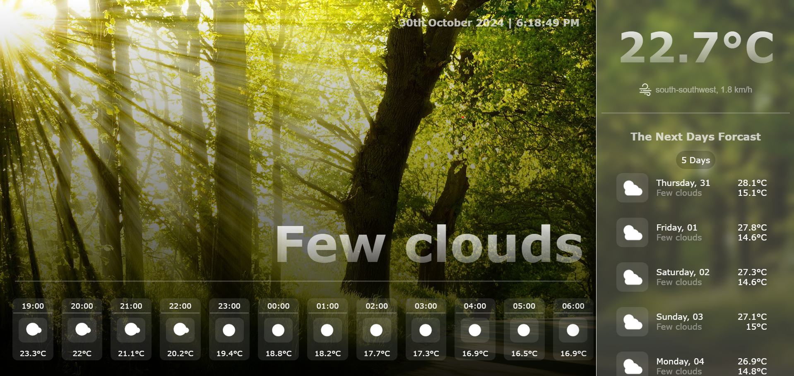

# React Weather App

A responsive and user-friendly weather application built with React, providing real-time weather information using the OpenWeatherMap API. This app allows users to search for current weather conditions in any city globally, displaying temperature, weather conditions, wind speed, and more.


## Features

- Search weather by city name (currently only for Islamabad, change the API call to search information for differnt cities) 
- Display current temperature, wind speed, and weather description
- Dynamic background that changes with weather conditions
- Responsive design for mobile, tablet, and desktop

## Screenshots


## Installation

1. **Clone the repository:**
   ```bash
   git clone https://github.com/SherAli2022000/React-Weather-App.git
